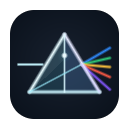
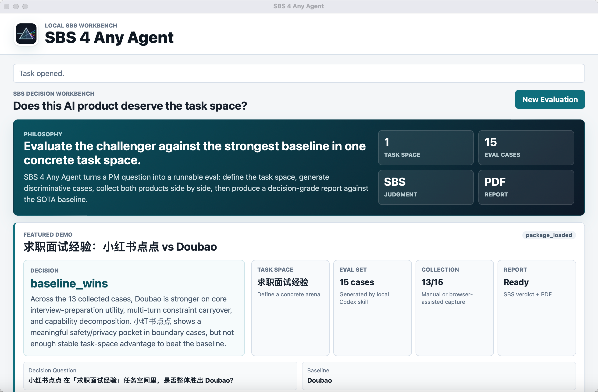
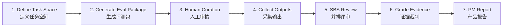

<p align="center">
  
</p>

# SBS 4 Any Agent

**Find out whether an AI product actually beats the strongest baseline in a concrete task space.**

**判断一个 AI 产品在具体任务空间里，是否真的打过最强基线产品。**

SBS 4 Any Agent is a local side-by-side evaluation workbench for AI chat products. It helps PMs, founders, AI builders, and serious AI users move from "this product feels better" to an evidence-backed product decision.

SBS 4 Any Agent 是一个面向 AI Chat 产品的本地 Side-by-Side 评测工作台。它帮助 PM、业务负责人、创业团队、AI 产品开发者和深度 AI 用户，把“感觉这个产品更好”变成一份有证据、有结论、有改进建议的产品判断。

<p align="center">
  <strong>From one eval idea to a systematic eval set, comparable evidence, a decision-grade report, and concrete optimization suggestions.</strong>
  <br />
  <strong>从一个测评想法，到系统化测试集、可比较证据、决策级报告和产品优化建议。</strong>
</p>

<p align="center">
  <a href="#use-the-app--直接使用-app">Download macOS App</a>
  ·
  <a href="examples/job-interview-xiaohongshu-vs-doubao/report.en.md">View Sample Report EN</a>
  ·
  <a href="examples/job-interview-xiaohongshu-vs-doubao/report.zh.md">查看中文报告</a>
  ·
  <a href="docs/extending-skills.md">Extension Guide</a>
</p>

<p align="center">
  
  <br />
  <sub>Local SBS workbench: task-space framing, featured demo, side-by-side verdict, and report readiness.</sub>
</p>

## From Eval Idea To Report / 从测评想法到报告

You do not need to start with a polished benchmark.

你不需要一开始就有一套成熟 benchmark。

Start with a question like:

你可以从一个问题开始：

> "Does product A beat Doubao for job interview coaching?"
>
> “产品 A 在求职面试建议这件事上，是否打过 Doubao？”

SBS helps you turn that into:

SBS 会把这个测评想法推进成：

1. a structured task-space definition;
2. a generated eval package with realistic cases;
3. a human-approved test set;
4. side-by-side collected outputs;
5. evidence-grounded case and dimension judgments;
6. a report with verdict, caveats, red lines, and optimization suggestions.

1. 一个结构化任务空间定义；
2. 一套由系统生成的真实场景 eval package；
3. 一套经过人工审核的测试集；
4. 双方产品的并排输出证据；
5. 基于证据的 case 级和维度级判断；
6. 一份包含结论、caveat、红线和优化建议的测评报告。

The report is "authoritative" in the practical product sense: it is case-based, evidence-backed, auditable, and explicit about uncertainty. It is not a black-box score, and it does not ask you to trust a judge model blindly.

这里的“权威”不是黑盒打分，也不是让你盲信一个 judge model。它是产品实践意义上的权威：基于 case、有证据链、可审计，并且明确说明不确定性。

## The Problem / 它解决什么问题

AI products are easy to demo and hard to judge.

AI 产品很容易 demo，但很难判断到底有没有真实价值。

Most comparisons stay too vague:

很多对比都停留在很泛的层面：

- "Which model is smarter?"
- "Which chatbot feels better?"
- "Which answer do I personally like?"
- “哪个模型更聪明？”
- “哪个 chatbot 体验更好？”
- “我个人更喜欢哪个回答？”

But product teams usually need a sharper answer:

但产品团队真正需要回答的是更尖锐的问题：

> For this user, in this task space, does our challenger beat the product people already trust?
>
> 对这类用户、在这个具体任务空间里，我们的挑战者产品，是否打过了用户已经会用的强产品？

For example:

例如：

- Does Xiaohongshu Diandian beat Doubao for job interview coaching?
- Does a vertical shopping assistant beat Doubao for high-intent purchase decisions?
- Does a coding agent beat Codex or Claude Code for a specific repo workflow?
- 小红书点点在“求职面试经验”任务里，是否打过 Doubao？
- 一个垂直购物助手，在高意图购买决策里，是否打过 Doubao？
- 一个 coding agent，在某个真实仓库工作流里，是否打过 Codex 或 Claude Code？

SBS is built for that kind of product decision.

SBS 就是为这种产品判断而设计的。

## Why It Is Useful / 为什么有用

SBS gives you a repeatable way to evaluate AI products without pretending that one generic benchmark can answer every product question.

SBS 提供一套可复用的方法，让你评估 AI 产品时不再依赖泛泛的榜单或主观感觉。

It helps you:

它可以帮你：

- **Define the task space**: what exact user job are we evaluating?
- **定义任务空间**：我们到底在评估哪类用户任务？
- **Generate evaluation cases**: what scenarios should both products face?
- **生成评测用例**：两个产品应该在什么场景里被比较？
- **Approve the test set**: which cases are fair, realistic, and worth running?
- **人工审核测试集**：哪些 case 足够真实、公平、有区分度？
- **Collect comparable outputs**: what did each side actually say or do?
- **采集可比输出**：双方产品实际给出了什么回答或证据？
- **Review side by side**: where did one product win, fail, drift, or hallucinate?
- **并排评审**：谁赢在哪里，谁跑偏、幻觉、越界或不够可执行？
- **Generate a PM-ready report**: what is the verdict, caveat, and optimization plan?
- **生成产品判断报告**：结论是什么，不确定性是什么，下一步该怎么优化？

The output is not just a score. The output is a decision memo:

它的产出不只是分数，而是一份产品判断 memo：

- who wins overall;
- which dimensions each side wins;
- which cases are missing or low-confidence;
- what evidence supports the verdict;
- what red lines appeared;
- what the weaker product should improve next.
- 谁整体胜出；
- 双方分别在哪些维度胜出；
- 哪些 case 缺失或低置信；
- 哪些证据支撑这个结论；
- 是否出现红线问题；
- 较弱的一方下一步应该怎么改。

## Who It Is For / 谁适合用

SBS is useful if you are:

如果你是下面这些人，SBS 会比较有用：

- an AI product manager deciding whether a feature is actually competitive;
- 一个 AI 产品经理，想判断某个能力是否真的有竞争力；
- a founder or business owner comparing your product against a market leader;
- 一个创业者或业务负责人，想把自己的产品和市场强基线对比；
- an AI engineer building evals around real product behavior, not only API outputs;
- 一个 AI 工程师，想围绕真实产品行为做 eval，而不只是测 API 输出；
- an AI enthusiast who wants a rigorous way to compare products in tasks you care about;
- 一个 AI 爱好者，想用更系统的方法比较自己关心的 AI 产品；
- a portfolio builder who wants to demonstrate agent PM thinking with runnable artifacts.
- 一个作品集构建者，想用可运行的 artifact 展示 Agent PM 能力。

You might use SBS when:

你可能会在这些场景里使用 SBS：

- you are deciding whether an AI feature is worth shipping;
- 你要判断一个 AI 功能是否值得上线；
- you are comparing a vertical AI app against Doubao, ChatGPT, Claude, Codex, or another strong baseline;
- 你要把一个垂直 AI 产品和 Doubao、ChatGPT、Claude、Codex 或其他强基线做对比；
- you want to build a task-space eval set before investing in model, prompt, or product iteration;
- 你想在投入模型、prompt 或产品迭代前，先建立一套任务空间 eval；
- you need a report that aligns PM, engineering, business, and leadership around evidence.
- 你需要一份能让 PM、工程、业务和管理层围绕证据对齐的报告。

## What You Put In, What You Get Back / 投入与回报

### You provide / 你需要提供

- A task space, such as job interview coaching, shopping guide, or restaurant recommendation.
- 一个任务空间，例如求职面试经验、购物导购、餐厅推荐。
- A challenger product name and access method.
- 一个挑战者产品，以及你如何访问它。
- A strong baseline, such as Doubao for chatbot tasks.
- 一个强基线，例如 chatbot 任务里的 Doubao。
- Human review of generated eval cases.
- 对生成 eval cases 的人工审核。
- Product outputs, either pasted manually or captured from a user-operated browser.
- 双方产品输出，可以手动粘贴，也可以从用户手动操作的浏览器页面中只读采集。

### You get / 你会得到

- A structured runtime eval package.
- 一个结构化 runtime eval package。
- A curated case set for the task space.
- 一套经过审核的任务空间评测 cases。
- Side-by-side evidence for baseline and challenger.
- 基线和挑战者的并排证据。
- Case-level and dimension-level judgments.
- case 级和维度级判断。
- A report with verdict, caveats, evidence excerpts, red lines, and optimization suggestions.
- 一份包含结论、caveat、证据摘录、红线和优化建议的报告。

### Cost / 成本

SBS does not magically remove PM judgment. It gives PM judgment a structured workflow.

SBS 不会替代 PM 判断。它做的是让 PM 判断有结构、有证据、可复查。

You still need to:

你仍然需要：

- define a meaningful task space;
- 定义一个有意义的任务空间；
- review generated cases;
- 审核生成的 cases；
- collect or paste outputs from both products;
- 采集或粘贴双方产品输出；
- read the final report critically.
- 批判性阅读最终报告。

The payoff is that your conclusion becomes inspectable and repeatable instead of a one-off vibe check.

回报是：你的结论不再只是一次性的主观感觉，而是可以被检查、复用和讨论的产品判断。

## How It Works / 它怎么工作



1. **Create an evaluation task.** Choose the task space, challenger, baseline, target users, and winning criteria.
2. **Generate an eval package.** The built-in eval-set generator proposes cases, turn scripts, coverage plans, and rubric suggestions.
3. **Curate cases.** A human approves, rejects, or edits cases before running them.
4. **Collect evidence.** Paste outputs manually, or use read-only assisted capture when available.
5. **Review side by side.** Inspect baseline and challenger outputs at case and turn level.
6. **Run the grader.** The grader cleans evidence, judges cases, aggregates the verdict, and preserves caveats.
7. **Export the report.** Use the report as a product decision artifact.

1. **创建评测任务。** 选择任务空间、挑战者、基线、目标用户和胜负标准。
2. **生成 eval package。** 内置 eval-set generator 会生成 cases、多轮脚本、覆盖计划和 rubric 建议。
3. **人工审核 cases。** 人类在正式采集前批准、拒绝或修改 cases。
4. **采集证据。** 可以手动粘贴输出，也可以在支持时使用只读辅助采集。
5. **并排评审。** 在 case / turn 粒度查看基线和挑战者输出。
6. **运行 grader。** grader 会清洗证据、评判 cases、聚合结论，并保留 caveats。
7. **导出报告。** 把报告作为产品判断 artifact 使用。

## Example / 示例

The current showcase example asks:

当前展示样例的问题是：

> Does Xiaohongshu Diandian beat Doubao in the job-interview-experience task space?
>
> 在“求职面试经验”任务空间里，小红书点点是否打过 Doubao？

The generated eval package contains 15 cases across:

生成的 eval package 包含 15 个 cases，覆盖：

- single-turn interview coaching;
- 单轮面试建议；
- scripted multi-turn clarification and correction;
- 多轮澄清、纠错和上下文承接；
- capability probes;
- 能力探针；
- boundary-risk scenarios, such as fabrication and privacy.
- 边界风险场景，例如造假、隐私和歧视。

The sample run collected 13 cases and produced this directional verdict:

样例 run 采集了 13 个 cases，产出方向性结论：

> Doubao wins overall on task utility, while Xiaohongshu Diandian shows a meaningful safety/privacy advantage in boundary cases.
>
> Doubao 在整体任务效用上胜出，但小红书点点在边界风险场景里有明确的安全/隐私优势。

Start here:

从这里开始看：

- [example overview](examples/job-interview-xiaohongshu-vs-doubao)
- [sample report EN](examples/job-interview-xiaohongshu-vs-doubao/report.en.md)
- [中文报告](examples/job-interview-xiaohongshu-vs-doubao/report.zh.md)
- [中文 PDF 报告](examples/job-interview-xiaohongshu-vs-doubao/report.zh.pdf)
- [eval package](examples/job-interview-xiaohongshu-vs-doubao/eval-package.json)

## What The Report Looks Like / 最终报告长什么样

The report is intentionally practical. It is not a flashy dashboard screenshot. It is a decision document you can open, read, challenge, and share.

报告故意做得很实用。它不是一个只适合截图的炫酷 dashboard，而是一份可以打开阅读、质疑、复查和分享的决策文档。

Sample verdict:

样例结论：

> Doubao wins overall on task utility, while Xiaohongshu Diandian shows a meaningful safety/privacy advantage in boundary cases.
>
> Doubao 在整体任务效用上胜出，但小红书点点在边界风险场景里有明确的安全/隐私优势。

The report includes:

报告包含：

- overall verdict and confidence;
- 总体结论和置信度；
- dimension scorecard;
- 维度分数表；
- key reasons and evidence excerpts;
- 关键原因和证据摘录；
- red-line failures and caveats;
- 红线问题和 caveats；
- case type breakdown;
- case 类型拆解；
- concrete optimization suggestions for the weaker product.
- 针对较弱产品的具体优化建议。

Open the sample:

打开样例：

- [English Markdown report](examples/job-interview-xiaohongshu-vs-doubao/report.en.md)
- [中文 Markdown 报告](examples/job-interview-xiaohongshu-vs-doubao/report.zh.md)
- [中文 PDF 报告](examples/job-interview-xiaohongshu-vs-doubao/report.zh.pdf)

## Use The App / 直接使用 App

For normal users, the easiest path is the macOS app.

对一般用户来说，最简单的方式是直接使用 macOS App。

1. Download the latest `.dmg` from [GitHub Releases](https://github.com/summer202007/SBS4ANY_LLM/releases/latest).
2. Open the DMG and drag `SBS 4 Any Agent.app` into Applications.
3. Launch the app.
4. Create an evaluation task and follow the workbench flow.

1. 从 [GitHub Releases](https://github.com/summer202007/SBS4ANY_LLM/releases/latest) 下载最新 `.dmg`。
2. 打开 DMG，把 `SBS 4 Any Agent.app` 拖到 Applications。
3. 启动 App。
4. 创建评测任务，然后按工作台流程完成测评。

The app runs locally. Your evaluation tasks, collected outputs, and reports stay on your machine unless you choose to share them.

App 在本地运行。你的评测任务、采集输出和报告默认留在你的机器上，除非你主动分享。

## Running From Source / 从源码运行

```bash
npm run dev
```

Then open / 然后打开：

```text
http://127.0.0.1:3000
```

This starts the same local SBS workbench in a browser. You can create or open an evaluation task, review packages and cases, collect outputs, and inspect reports from the browser UI.

这会在浏览器中启动同一个本地 SBS 工作台。你可以在浏览器 UI 里创建或打开评测任务，查看 package 和 cases，采集双方输出，并查看报告。

The app stores local task, package, run, and report artifacts under `data/`. That directory is ignored because it is local workspace state.

App 会把本地 task、package、run、report 等产物写入 `data/`。这个目录属于本地工作区状态，默认不进 Git。

## What Is Inside / 仓库里有什么

| Area | What it does / 作用 |
| --- | --- |
| `web/` | Browser UI for tasks, packages, cases, collection, review, and reports. 浏览器 UI。 |
| `server/` | Local Node server for storage, package generation, capture, grading, and report export. 本地 Node 服务。 |
| `skills/chatbot-eval-set-generator/` | Generates task-space-specific runtime eval packages. 生成任务空间评测包。 |
| `skills/chatbot-sbs-grader/` | Cleans evidence, grades cases, and writes reports. 清洗证据、裁判 cases、生成报告。 |
| `skills/chatbot-website-capture-adapter-builder/` | Builds and QA-gates read-only website capture adapters. 构建并 QA 只读网页采集适配器。 |
| `skills/chatbot-runtime-user-simulator/` | Suggests side-blind next user turns for multi-turn evals. 为多轮评测生成 side-blind 下一轮用户消息。 |
| `examples/` | Sanitized public examples. 公开样例。 |
| `docs/` | Concepts, extension docs, roadmap, and design notes. 概念、扩展说明、路线图和设计文档。 |

## Extending The Workbench / 如何扩展

SBS is designed to be forked around new task spaces, baselines, challengers, and product surfaces.

SBS 的设计目标之一，就是让开发者可以围绕新的任务空间、基线、挑战者和产品表面 fork / 扩展。

Bring your own task space, baseline, challenger, and capture adapter.

你可以带着自己的任务空间、基线产品、挑战者产品和采集适配器来扩展。

Common extension paths:

常见扩展方向：

- Add a new task-space example under `examples/`.
- 在 `examples/` 下新增一个任务空间样例。
- Improve eval generation references under `skills/chatbot-eval-set-generator/references/`.
- 在 `skills/chatbot-eval-set-generator/references/` 中优化 eval 生成方法。
- Add grader dimensions, report rules, or validators under `skills/chatbot-sbs-grader/`.
- 在 `skills/chatbot-sbs-grader/` 中新增评分维度、报告规则或校验器。
- Add read-only capture adapter contracts under `skills/chatbot-website-capture-adapter-builder/`.
- 在 `skills/chatbot-website-capture-adapter-builder/` 中新增只读采集适配器契约。
- Add future non-chatbot arenas, such as coding agents or workflow agents.
- 未来新增非 chatbot 评测场，例如 coding agents 或 workflow agents。

Read / 继续阅读：

- [docs/concepts.md](docs/concepts.md)
- [docs/extending-skills.md](docs/extending-skills.md)
- [docs/capture-adapters.md](docs/capture-adapters.md)
- [docs/roadmap.md](docs/roadmap.md)

## Safety And Collection Boundary / 安全与采集边界

Assisted capture is user-operated and read-only.

辅助采集必须是用户操作、工具只读。

SBS should not:

SBS 不应该：

- auto-send prompts into third-party products;
- 自动向第三方产品发送 prompt；
- bypass login, verification, paywalls, or anti-bot controls;
- 绕过登录、验证、付费墙或反自动化机制；
- scrape hidden data;
- 读取隐藏数据；
- treat unsupported fields as if they were model traces.
- 把不支持的字段假装成模型 trace。

Manual paste remains the universal fallback.

手动粘贴永远是兜底方案。

## Current Scope / 当前范围

This repository is currently a local chatbot SBS workbench. The "Any Agent" direction is a roadmap: the architecture is intended to expand to coding agents, research agents, and workflow agents, but the first public release should be judged by the chatbot SBS loop.

当前这个仓库首先是一个本地 chatbot SBS 评测工作台。“Any Agent” 是路线图方向：架构上希望扩展到 coding agents、research agents、workflow agents，但第一版公开发布应该主要以 chatbot SBS 闭环来判断完成度。

## Development Scripts / 开发脚本

If you want to work on the app itself, these scripts are useful:

如果你想开发这个 app 本身，可以使用这些脚本：

```bash
npm run dev
npm run desktop:dev
npm run desktop:build
npm run desktop:release
```
