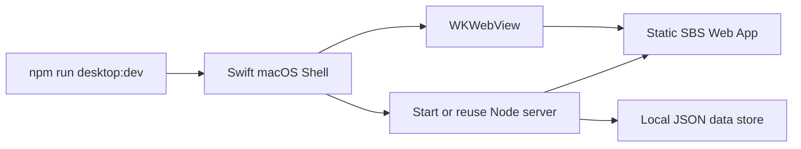

# Desktop App Migration Sprint

Created: 2026-06-10

## Goal

Move the current local Web App into a local macOS app shell while preserving the existing fast development loop.

This sprint is not about building the final distributed `.dmg`. It is about making the current SBS workbench run as a desktop app during development, so later assisted capture and local-provider integrations can sit beside the app rather than outside it.

## Decision

Use a native macOS dev shell first:

- Swift/AppKit executable;
- AppKit app lifecycle;
- WKWebView as the embedded browser;
- existing Node server and `web/` app remain unchanged;
- local file storage continues under `data/`.

Why this route:

- no new npm dependencies;
- no Electron/Tauri install step;
- works with the existing static Web App immediately;
- direct `swiftc` compilation gives a fast hot-test loop;
- later `.app` packaging can reuse the same shell.

## Current Architecture



## Developer Commands

```bash
npm run dev
```

Runs the browser-hosted Web App at `http://127.0.0.1:3000`.

```bash
npm run desktop:dev
```

Builds a temporary dev `.app` under `.build/desktop-dev/` and opens it. This is the normal hot-test command.

```bash
npm run desktop:run
```

Runs the same shell in the foreground for terminal logs/debugging.

```bash
npm run desktop:build
```

Compiles the desktop shell without launching it.

Implementation note:

- The repo includes `desktop/Package.swift` for future Swift Package migration.
- Current hot-test scripts use direct `swiftc` compilation through `scripts/desktop/build_dev.sh` because this Mac's active Command Line Tools installation does not provide the `xcrun --show-sdk-platform-path` metadata required by SwiftPM.

## Hot-Test Behavior

During development:

- no `.dmg` is built;
- no app installation is required;
- `npm run desktop:dev` opens a temporary `SBS 4 Any Agent.app` from `.build/desktop-dev/`;
- web changes are tested by reloading the desktop window with `Cmd+R`;
- Swift shell changes require restarting `npm run desktop:dev`;
- the shell starts the Node server if it is not already running;
- if `npm run dev` is already running, the shell reuses it.

## Implemented Scope

The desktop shell currently migrates all existing Web App capabilities because it loads the same local Web App:

- task list;
- New Evaluation modal;
- Package page;
- Cases curation;
- Collect page;
- Review page;
- Report page;
- local JSON storage;
- existing APIs.

The shell itself adds:

- native macOS window;
- embedded WKWebView;
- local server startup/reuse;
- basic `Cmd+R` reload menu;
- app quit handling that terminates a server process started by the shell.

## Not Yet Implemented

- distributable `.app` bundle;
- `.dmg`;
- app icon/signing/notarization;
- native capture helper UI;
- Chrome active-tab capture;
- local Codex invocation from the desktop shell;
- menu bar helper.

## Risks And Notes

- This is a development shell, not the final packaged app.
- The Node server is still the source of backend behavior.
- If another process is already using port `3000`, the shell will try to reuse it if `/api/health` responds.
- If port `3000` is occupied by a non-SBS process, startup will fail and the app will show an error.
- WKWebView may differ slightly from Chrome in browser behavior, so capture-provider testing still needs the user's real Chrome for Doubao.

## Next Steps

1. Add capture session API to the Node server.
2. Add capture session UI to Collect.
3. Add Chrome `.command` helper that POSTs into the local server.
4. Later wrap helper into a `.app`.
5. Later package the whole workbench as a true macOS `.app` and optional `.dmg`.
