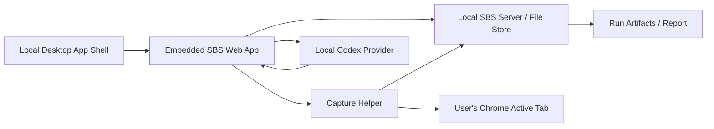

# Local Desktop Capture Sprint

Created: 2026-06-10

## Decision

Switch the next product slice from pure browser-hosted Web App/manual paste to a local desktop-assisted workflow:

- The SBS workbench remains the main product surface.
- The Web App can later be embedded inside a local desktop app shell.
- External AI products, especially Doubao, are operated by the user in their real browser.
- The local app/helper does not auto-send prompts into third-party products.
- After the user sends the prompt and waits for the answer, the local app/helper reads the active browser page as a capture source.
- Capture is read-only DOM/page extraction plus optional screenshot/raw text preservation.

This replaces the unsafe direction of launching a fresh automated browser profile and sending prompts automatically, which can trigger anti-bot verification.

## Product Logic Evaluation

The proposed flow is feasible and directionally correct:

1. Carrier is a local desktop app.
2. The current Web App can be embedded in the local app shell.
3. After eval case generation and approval, the app shows the current prompt to collect.
4. The user logs into Chrome or uses their normal browser manually.
5. The user sends the model-facing prompt in the target product.
6. After the browser replies, the user returns to the app and clicks `Capture`.
7. The app shows extracted capture fields and lets the user accept/edit them.
8. User clicks next case or next turn.
9. For multi-turn cases, the app asks local Codex to suggest the next shared user message when needed.
10. If local Codex decides the case should stop, the app marks the case complete and advances.
11. Continue until all required sides/cases/turns are collected.

This is still automation, but with a safer boundary:

- user performs external product actions;
- app automates prompt management, current-page capture, structure extraction, state tracking, local next-turn generation, and report inputs.

## Needed Refinements

### Side-Specific Collection

The capture workflow must know which side is being collected:

- `baseline` for Doubao;
- `challenger` for the evaluated product;
- later, custom provider IDs.

Each side has:

- surface/access mode;
- collection status;
- capture method;
- evidence level;
- raw capture artifacts;
- normalized fields.

For MVP, Doubao gets the first assisted capture adapter. Challenger remains manual unless it is also a supported web surface.

### Capture Should Be Explicitly Read-Only

The helper should not:

- open a new automation browser profile;
- type prompts;
- submit messages;
- bypass verification;
- scrape hidden/private data beyond the active page the user intentionally wants to capture.

The helper should:

- read current Chrome active tab URL;
- run read-only JavaScript in the current page;
- extract visible text/DOM fields;
- optionally take a screenshot;
- POST result to local SBS API or copy JSON to clipboard.

### Manual Fallback Is Mandatory

Every assisted capture step needs fallback controls:

- paste final answer manually;
- paste capture JSON manually;
- mark side as caveated;
- edit extracted fields before accepting.

This keeps the app usable when:

- browser permission fails;
- DOM structure changes;
- target product is a mobile app;
- target product blocks script execution;
- answer does not expose references/search trace.

### Multi-Turn Cursor Ownership

The app/harness owns all runtime state:

- `taskId`;
- `packageId`;
- `caseId`;
- `turnIndex`;
- `side`;
- `priorTurns`;
- `latestBaselineResponse`;
- `latestChallengerResponse`;
- `modelVisibleFacts`;
- `exposureDelta`;
- `collectionStatus`.

Local Codex must not decide which case or turn is active from memory. It receives a fresh state packet and returns a bounded suggestion.

### Shared Next User Message

For SBS fairness, multi-turn collection should use one shared next user message for both sides whenever possible.

Default flow:

1. user collects baseline/challenger response for current turn;
2. app calls local Codex with both visible responses, case contract, turn script, and state;
3. local Codex suggests one next user message that is fair to both sides;
4. user reviews/edits the message;
5. app marks it as next turn input for both sides;
6. user sends it manually to both products.

If one side asks a clarification that the other side does not, Codex can suggest a fair shared clarification answer only if it is allowed by branch rules/exposure contract. Otherwise the app should ask for human review.

### Stop Decision

Local Codex can suggest:

- `continue`: produce next shared user message;
- `stop_case_success`: enough information was collected;
- `stop_case_failure`: case cannot proceed normally;
- `needs_human_review`: branch/exposure/fairness is ambiguous.

The app must show the decision and allow the user to override.

### Capture Result Review

After clicking `Capture`, the app should show a normalized result before saving:

- final answer;
- visible process notes;
- source/reference notes;
- search keywords;
- reference materials;
- risk notices;
- follow-up suggestions;
- toolcall/execution notes if exposed;
- raw visible text preview;
- URL;
- screenshot/raw artifact refs;
- evidence level suggestion.

User can edit, accept, or discard.

## Target Architecture



## Main Components

### Desktop Shell

Recommended staged approach:

1. MVP: keep current local Web App and add a `.command` helper.
2. Next: package helper as a macOS `.app`.
3. Later: embed Web App in a desktop shell such as Electron or Tauri.

Rationale:

- `.command` validates permissions and capture reliability fastest.
- `.app` improves user-facing polish without changing core logic.
- Full desktop shell should wait until capture and local model integration work.

### Capture Helper

Responsibilities:

- locate active Chrome tab;
- verify URL matches supported provider;
- execute provider-specific read-only extraction script;
- return structured capture JSON;
- POST to `http://127.0.0.1:3000/api/captures`;
- optionally copy JSON to clipboard if POST fails.

Initial provider:

- `doubao_web`.

Future providers:

- generic web chatbot;
- Xiaohongshu Diandian web if available;
- clipboard/manual provider;
- screenshot/OCR provider.

### Provider Adapter: Doubao Web

Target fields:

```ts
type DoubaoCapture = {
  provider: "doubao_web";
  url: string;
  capturedAt: string;
  finalAnswer: string;
  expandedSearchQueries: string[];
  referenceMaterials: Array<{
    rank?: number;
    title: string;
    href?: string;
    sourceName?: string;
  }>;
  riskNotices: string[];
  followupSuggestions: string[];
  visibleProcessNotes?: string;
  toolcallNotes?: string;
  rawVisibleText: string;
  screenshotArtifactRef?: string;
};
```

Extraction is opportunistic:

- if search keywords are visible, capture them;
- if reference list is visible, capture it;
- if follow-up suggestions are visible, capture them;
- if a field is not exposed in this run, store an empty array and a note.

### Local SBS API

Add endpoints:

- `POST /api/captures`
  - receives capture payload from helper;
  - stores raw artifact;
  - attaches capture to active task/case/turn/side when an active capture session exists.

- `GET /api/capture/session`
  - returns current expected case/turn/side and capture token.

- `POST /api/capture/session/start`
  - starts capture mode for a specific side/case/turn.

- `POST /api/capture/session/accept`
  - accepts normalized capture into run state.

- `POST /api/capture/session/discard`
  - discards a pending capture.

### Local Codex Next-Turn Provider

Add a later endpoint:

- `POST /api/runtime/next-turn`

Input:

- current case;
- turn script;
- exposure contract;
- latest visible transcripts from both sides;
- model-visible facts;
- allowed branch rules/adaptive moves.

Output:

```ts
type NextTurnDecision = {
  decision: "continue" | "stop_case_success" | "stop_case_failure" | "needs_human_review";
  sharedUserMessage?: string;
  selectedBranchRuleIds?: string[];
  rationale: string;
  newlyExposedFacts: string[];
  validationWarnings: string[];
};
```

The Web App shows this as a draft. User must confirm before using it.

## User Flow

### Single-Turn Assisted Capture

1. User enters Collect.
2. App shows current case and selected side.
3. App shows `Copy Prompt`.
4. User copies prompt.
5. User goes to Chrome and sends prompt in Doubao/challenger.
6. User waits for answer to finish.
7. User returns to app and clicks `Capture Current Browser Page`.
8. Helper reads active Chrome tab.
9. App shows extracted result preview.
10. User edits fields if needed.
11. User clicks `Accept Capture`.
12. App saves capture to the current side.
13. App advances to the next missing side/case.

### Multi-Turn Assisted Capture

1. App shows current case and turn index.
2. App shows the shared user message for this turn.
3. User sends it to both products manually.
4. User captures baseline side.
5. User captures challenger side or manually pastes challenger response.
6. App confirms both sides for this turn are collected.
7. User clicks `Suggest Next Turn`.
8. Local Codex returns continue/stop/review decision.
9. If continue, app shows shared next user message.
10. User reviews/edits/accepts.
11. App advances to next turn.
12. If stop, app marks case complete and advances.

## Sprint Plan

### Phase A: Document And Data Model Alignment

Status: planned.

Tasks:

1. Update `PROJECT_BRIEF.md` to reflect desktop-assisted capture route.
2. Update data model with capture session, capture artifact, and normalized provider fields.
3. Update frontend sprint to replace "automatic browser automation" with "user-operated browser + assisted capture".
4. Add dev diary entry for route change.

Acceptance:

- Future agents understand that we do not auto-send prompts to Doubao.
- Capture helper route is persistent project context.

Checkpoint:

- User reviews this sprint before implementation.

### Phase B: Capture Session UI

Status: planned.

Tasks:

1. Add capture mode controls to Collect page:
   - active case/turn/side;
   - copy prompt;
   - start capture session;
   - capture current browser page;
   - paste capture JSON fallback.
2. Add pending capture preview panel.
3. Add accept/discard capture actions.
4. Add normalized fields for Doubao search/reference/risk/suggestions.
5. Keep manual paste fields available.

Acceptance:

- User can understand exactly which side/case/turn the capture will attach to.
- Capture preview does not overwrite saved run state until accepted.

### Phase C: Local Capture API

Status: planned.

Tasks:

1. Add capture session storage under current run.
2. Add `/api/capture/session/start`.
3. Add `/api/captures`.
4. Add `/api/capture/session/accept`.
5. Add artifact persistence:
   - raw JSON;
   - raw visible text;
   - optional screenshot path.
6. Map normalized capture into existing side fields:
   - final output;
   - source/citation notes;
   - visible process notes;
   - toolcall notes;
   - evidence level suggestion;
   - collection notes.

Acceptance:

- A mocked capture payload can be attached to baseline side of `rest-st-001`.
- Refresh preserves pending and accepted capture state.

### Phase D: `.command` Helper For Chrome

Status: planned.

Tasks:

1. Create `scripts/capture/doubao_chrome_capture.scpt` or equivalent AppleScript.
2. Create `SBS Doubao Capture.command`.
3. The helper reads Chrome active tab:
   - URL;
   - visible text;
   - provider-specific DOM fields via JavaScript.
4. Helper POSTs to local SBS API.
5. If POST fails, helper copies JSON to clipboard and shows a clear message.
6. Add first-run permission instructions for macOS Automation access.

Acceptance:

- User manually opens a Doubao result page.
- User runs `.command`.
- The app receives a capture payload.
- No prompt is automatically sent to Doubao.

### Phase E: Doubao Provider Extraction

Status: planned.

Tasks:

1. Implement Doubao extraction script for visible answer.
2. Extract search keywords when visible.
3. Extract reference materials when visible.
4. Extract risk notices.
5. Extract follow-up suggestions.
6. Preserve raw visible text for audit/debug.
7. Add fallback extraction when answer container selector fails.

Acceptance:

- On a Doubao page with the four UI elements visible, capture JSON includes all four.
- On a Doubao page without those elements, arrays are empty and `captureNotes` says not exposed.

### Phase F: Multi-Turn Next-Turn Draft

Status: planned after single-turn capture works.

Tasks:

1. Add `Suggest Next Turn` button when both sides for a turn are collected.
2. Build state packet from approved package, turn script, exposure contract, and visible transcripts.
3. Call local Codex only.
4. Validate:
   - no evaluator-only leakage;
   - no unapproved new constraints;
   - cursor matches active case/turn;
   - shared message is fair to both sides.
5. Show decision and draft message.
6. Require human accept/edit.

Acceptance:

- Multi-turn case can advance using local Codex-suggested shared user messages.
- If Codex returns stop/review, app handles it gracefully.

### Phase G: Package As `.app`

Status: optional polish after `.command` is stable.

Tasks:

1. Wrap helper in macOS `.app`.
2. Replace Terminal output with simple success/failure dialogs.
3. Add app icon/name.
4. Add setup instructions.

Acceptance:

- User can run capture helper without seeing Terminal.

### Phase H: Desktop Shell

Status: later.

Tasks:

1. Choose Electron or Tauri.
2. Embed current Web App.
3. Bundle local server lifecycle.
4. Bundle capture helper.
5. Bundle local config and storage path.

Acceptance:

- User opens one local desktop app to run the SBS workflow.

## Immediate Next Implementation Slice

Build the smallest useful version:

1. Add capture session state and mocked capture accept flow in Web App.
2. Add fields for Doubao four-element capture.
3. Add `POST /api/captures`.
4. Add `.command` helper that reads Chrome active tab and POSTs JSON.
5. Test with the restaurant `rest-st-001` case.

Do not build full desktop shell yet. Prove capture reliability first.
